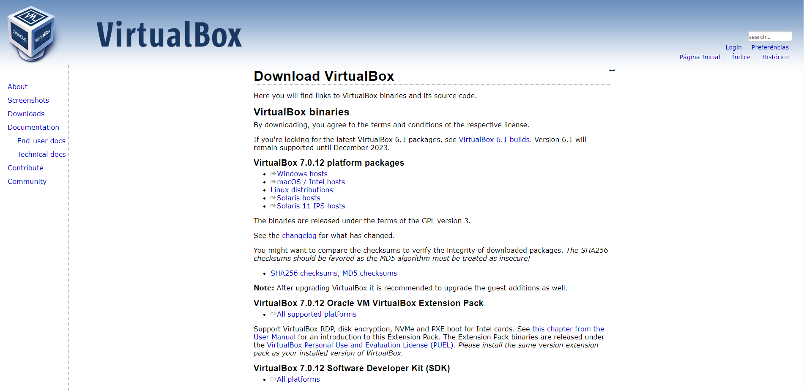

# sprint.uol
## Desafio 1
### Instalando um servidor Oracle Linux 8.x em uma virtual Box 

Primeiro, faça o download do Virtual Box no site:<b><b>
https://www.virtualbox.org/wiki/Downloads <b><b>

<b><b>
clique em próximo até finalizar.
<b><b>
Baixe o Oracle Linux:<b><b>
https://edelivery.oracle.com<b><b>
<b><b>
<b><b>
Faça login ou crie uma nova conta
Busque por Oracle Linux
Escolha a versão 8.1<b><b>

<b><b>

Em plataformas e idiomas clique seta para baixo e selecione a arquitetura da sua plataforma e clique em continuar
Revise e assine os termos de adesão e clique na caixa de seleção para aceitar o contrato de licença e clique no botão continuar

Assim que terminar o download, acesse a VM para continuar a instalação, escolha a opção padrão “Testar mídia e instalar Oracle Linux” e logo será exibida uma janela de boas vindas, então selecione o idioma a ser usado e clique em continuar.
Configure o layout do teclado 
O idioma
O fuso horário que pode ser ajustado manualmente
Sempre clicando em concluído (Done) para voltar a tela de resumo da instalação
Escolha o software a ser usado 
Selecione o destino da instalação
Caso deseje ter um recurso mais avançado do kernel em relação a imagem, selecione o kdump 
Caso deseje pode configurar os recursos de rede ou deixar em configuração automática
Você pode adicionar uma política de segurança ou não de acordo com a necessidade do seu projeto
Clique no botão iniciar instalação
Enquanto a instalação é realizada, defina o seu usuário e senha root
Defina também se esse usuário terá privilégios de administrador no sistema usando o sudo
Após completar a instalação o sistema inicializará a sua instalação do Oracle Linux e é só colocar o seu usuário e senha.

Repita o processo para criar outra VM na opção server (Sem GUI)

## Desafio 2
### Configurando o IP fixo nos dois servidores 
A primeira observação que eu fiz foi que o DHCP precisa estar desabilitado.
Podemos configurar o IP de dois modos, o modo temporário e o permanente, aqui vou lhe mostra como configurar de modo permanente editando o arquivo, dessa forma ele presiste diante de uma reinicialização.
Você pode acessar o arquivo onde estão as informações referente ao IP da sua máquina com o comando:
    sudo nano /etc/sysconfig/network-scripts/ifcfg-enp0s3
Dentro desse arquivo iremos alterar alguns itens e x será um número escolhido por você para definir a sua rede:

BOOTPROTO= none
IPADDR= 192.168.X.XX
PREFIXO= 24
GATEWAY= 192.168.x.x
DNS1= 8.8.8.8
DNS2= 8.8.4.4

Eu usei o DNS público do Google, mas você pode utilizar outros, procure sempre DNS confiáveis

Feito isso, irá salvar
Ctrl + O
e sair:
Ctrl + X
Reinicie o serviço de rede após editar o arquivo com o comando;
    systemctl restart network

Faça o mesmo na outra VM
Para finalizar essa etapa vamos verificar se as duas VMs conversam usando o camando ping e o IP da outra VM. 
A resposta será parecida com a imagem:<b><b>

<b><b>

### Criando um NFS do servidor 1 para o servidor 2. 

## Desafio 3

### Instalando o Mariadb na VM01 

### Instalando o Wordpress na VM02

### Salvando os estáticos do wordpress

# Alguns desafios que você pode passar:
1- Não criei o meu usuário e senha:
sudo user add nome-do-usuario
sudo password senha-de-usuario
repita a senha-de-usuario

Firewalld is not running.
Eu tive problemas com o firewall, ele não estava habilitado, então eu segui os comandos:
    sudo yum install firewalld
    sudo systemctl enable firewalld
    sudo systemctl start firewalld

